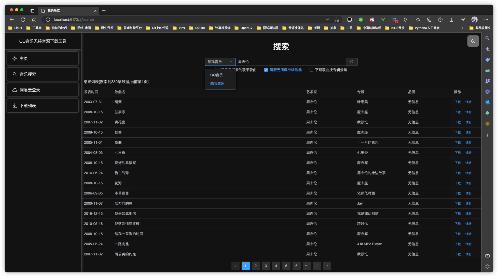
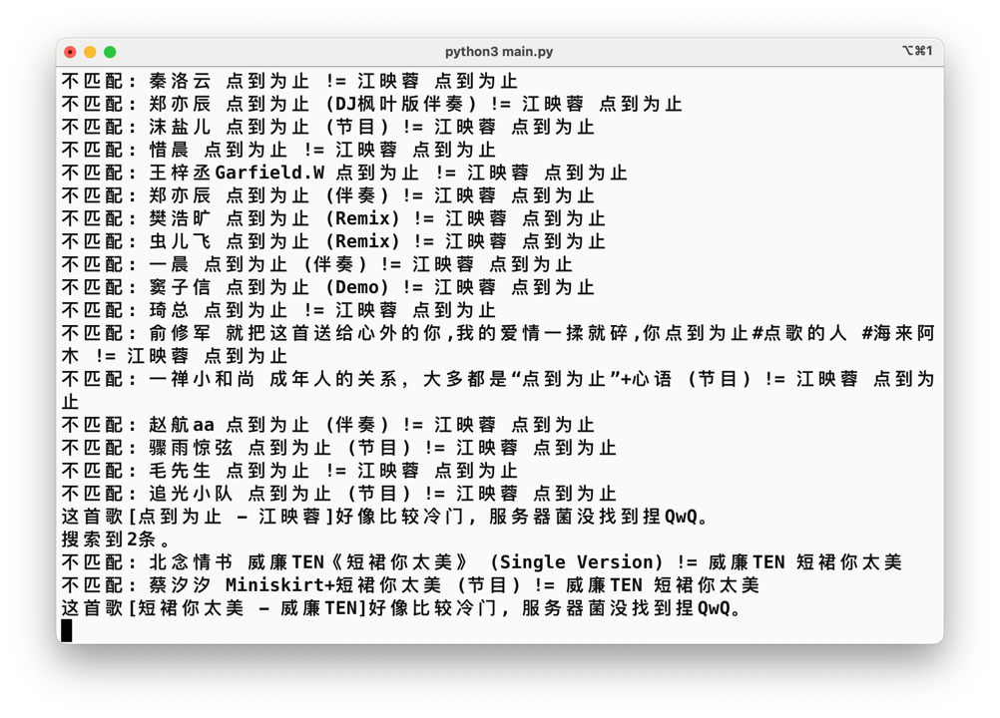
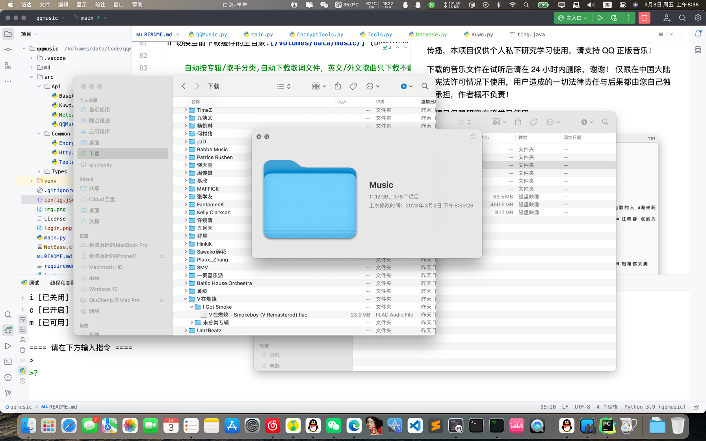

# 20230302, 告知各位本项目又复活啦！

# 项目介绍

这是一个批量下载 QQ 音乐/酷我音乐歌曲的脚本,技术含量并不是很大,仅供参考。

# 请先阅读以下内容：

由于不可抗力因素,获取共享绿钻 QQ 的 Cookie 的方式已经失败。

目前本项目只能用于搜索 qq 音乐中的歌曲列表，并获取相关信息。

由于没有绿钻 QQ Cookie,将无法正常使用批量下载。

如果您有自己的绿钻 Cookie，请不要随意共享给他人，以免造成 qq 账号被封停。本项目目前依然可用部分功能：

1. 搜索
2. 有绿钻 Cookie 后依然可以正常批量下载
3. 昨天又逆向了一个共享App，现在可以批量下载了。

# 使用方法

## 新功能 同步网易云我的喜欢歌单并从qq曲库下载精准匹配无损歌曲下载

### 实现原理

使用NeteaseNodejsAPI接口登录获取用户歌单信息

然后会保存到本地config里面 避免下次重复读取

也可根据需要刷新缓存

提示：由于QQ音乐接口访问频率限制 有时候歌曲获取不到 多刷新几次就好了

### 使用方法

为确保账户安全，用户token本地按需保留。且线上服务使用扫码登录。

界面输入m在未登录情况下会弹出二维码登录，登录情况下会自动匹配qq曲库。

使用前一定要关掉所有的过滤选项！（如 o i 两个功能 否则搜索不到歌曲）



## 如果你需要生成 requirements.txt 文件

```bash
pip install pipreqs # 安装
pipreqs ./ --encoding=utf8 --force # 在文件夹中执行
```

## 安装环境步骤

首先安装最新的 python3 到你的操作系统里。

如果安装依赖包出现 404 错误或者太慢，可以用下面的代码切换到清华大学服务器安装。

```bash
# 设置python的依赖安装镜像服务器为清华大学服务器
pip3 config set global.index-url https://pypi.tuna.tsinghua.edu.cn/simple
```

终端/控制台 进入到本文件所在的目录 执行以下指令:

```bash
python3 -m venv ./venv # 生成虚拟化环境
source ./venv/bin/activate # 激活虚拟化环境
#如果你不使用虚拟环境可以跳过执行上面的代码
pip3 install -r requirements.txt # 安装必须包
python3 main.py
```

【Windows 用户注意】

FileNotFoundError 是因为代码没有处理判断 Windows 操作系统的路径处理，我这里的主机是 macOS 系统，请拉取最新的代码以修复此问题。

---

# 说明书

输入 n p a s t o h 等缩写即可

n 切换下一页 (Next)

p 切换上一页 (Previous)

a 一键下载本页所有歌曲 (All)

1 若要下载某一首,请输入歌曲前方的序号.(如: 1) (Single)

s 修改搜索关键词 (Search)

t 当前[32]线程,修改并发. (Thread)

---

o 切换模式:仅显示搜索的歌手歌曲 [已关闭] (OnlyMatchSinger&Songer)

    如果打开此选项则搜索结果只显示和你搜索关键词一致的歌手名称。如搜索 ‘周杰伦’ 但是列表会显示 蔡依林 的歌曲，打开此选项则会自动过滤非‘周杰伦’歌手的歌曲，则最后只显示‘周杰伦’的歌曲

---

h 切换当前下载缓存的主目录.[/Volumes/data/music/] (Download Home)

    自动按专辑/歌手分类,自动下载歌词文件，英文/外文歌曲只下载不翻译的歌词版本

# 声明

本代码 GPLV3 授权使用，禁止商业用途，仅供研究学习 python 技术使用，不得使用本代码进行任何形式的牟利/贩卖/传播，禁止在 qq
群传播，本项目仅供个人私下研究学习使用，请支持 QQ 正版音乐！

下载的音乐文件在试听后请在 24 小时内删除，谢谢！
仅限在中国大陆的宪法许可情况下使用，用户造成的一切法律责任与后果都由您自己独自承担，作者概不负责！

本项目仅限研究交流学习使用。





# 其他资料

[早期接口 QMD Apk的逆向过程](./md/README.md)