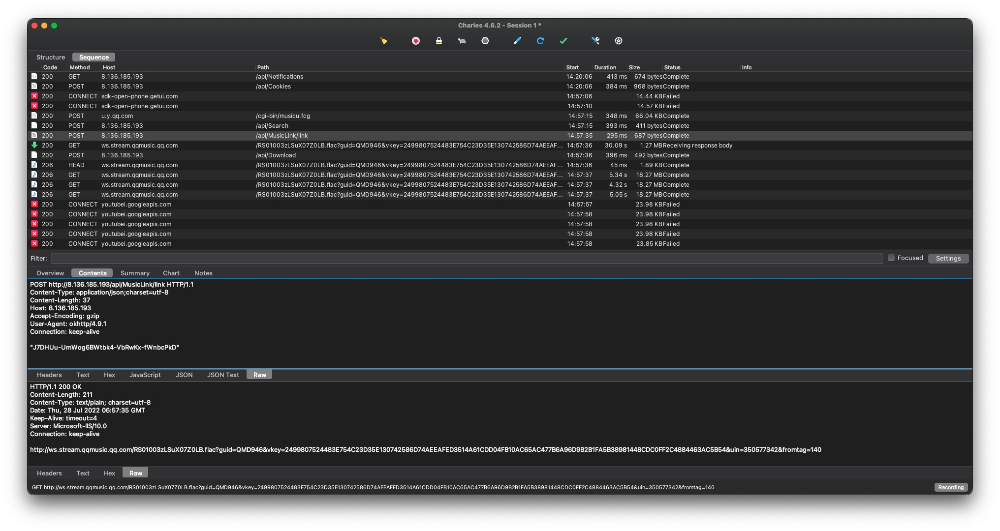
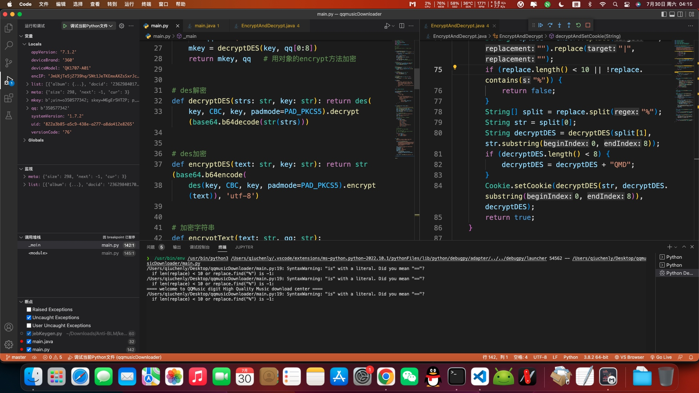

# 项目介绍
## 这是一个通过QMD 1.7.2.apk逆向出来的一个批量下载QQ音乐歌曲的脚本
---
# 使用方法
【必须操作】首先安装最新的python3到你的操作系统里。

【可选操作】换成国内的阿里云的pip源，否则安装依赖包会出现404错误。

终端/控制台 进入到本文件所在的目录 执行以下指令:
```python3
pip3 install requests
pip3 install pyDes
python3 main.py
```
【Windows用户注意】macOS/类Unix用户无需注意

FileNotFoundError是因为代码没有处理判断Windows操作系统的路径处理，我这里的主机是macOS系统，请拉取最新的代码以修复此问题。

# 说明书
输入 n p a s t o h 等缩写即可

n 切换下一页 (Next)

p 切换上一页 (Previous)

a 一键下载本页所有歌曲 (All)

1 若要下载某一首,请输入歌曲前方的序号.(如: 1) (Single)

s 修改搜索关键词 (Search)

t 当前[32]线程,修改并发. (Thread)

---
o 切换模式:仅显示搜索的歌手歌曲 [已关闭] (OnlyMatchSinger&Songer)

    如果打开此选项则搜索结果只显示和你搜索关键词一致的歌手名称。如搜索 ‘周杰伦’ 但是列表会显示 蔡依林 的歌曲，打开此选项则会自动过滤非‘周杰伦’歌手的歌曲，则最后只显示‘周杰伦’的歌曲，
---


h 切换当前下载缓存的主目录.[/Volumes/data/music/] (Download Home)

自动按专辑/歌手分类,自动下载歌词文件，英文/外文歌曲只下载不翻译的歌词版本

# 声明
本代码GPLV3授权使用，禁止商业用途，仅供研究学习python技术使用，不得使用本代码进行任何形式的牟利/贩卖/传播，禁止在qq群传播，本项目仅供个人私下研究学习使用，请支持QQ正版音乐！下载代码学习后请在24小时内删除，谢谢！
仅限在中国大陆的宪法许可情况下使用，用户造成的一切法律责任与后果都由您自己独自承担，本人概不负责！本项目仅限研究交流学习使用。

# 逆向一个QMD QQ音乐源下载软件
这个Apk主要是用来下载QQ音乐的无损数字音频文件，我为了把我iMac上的mp3音质音乐替换为flac或者HiRes无损，一个个去网上找文件。偶然间在网上发现了这个app，有些好奇怎么实现的，于是做本篇分析文章。

## 第一步 反射大师脱壳
对于类似于这种神奇的软件作者总会加个壳加加固保护一下源代码，我有种直觉这玩意应该也是加了固的，果然打开zip文件一看：
libjiagu.so赫然在目。。。得，直接打开反射大师先来扒一层皮看看能不能看到里面。
**反射大师脱壳过程不再赘述，直接导出内存dex即可。**

## 第二步 JEB静态分析
可喜可贺，2021年初还只有Jeb 3.24，坐了一年牢出来发现竟然有4.x的版本更新了，好，很有精神！

首先我们打开app开始下载高解析度音频，看看加密如何。


我们关注一下上图的/api/Download请求。
这个包是用来获取QQ音乐的文件实际下载地址，我们来看看这个请求：
一个迷之数据，一个朴实无华的http请求，再无其他。
只有下面的一个http://ws.stream.qqmusic.qq.com/RS01003zLSuX07Z0LB.flac接口关联他。那么为了得到这个qqmusic的源数据，我们要批量下载这些音乐就需要逆向出这个迷之数据到底是什么东西，我们如何生成它。

```
接口表

获取音乐的高解析度下载地址
/api/MusicLink/link
```

那么话不多说，jeb直接打开导出的dex看函数，搜索这个字符串。


直接可以看到这个搜索结果了，很好，看来不需要再去找其他的dex文件了。
tab一下看看。

关注以下函数:
```java
public String getMusicLink(String arg4) {
    String v4 = EncryptAndDecrypt.encryptText(arg4);
    String v4_1 = new HttpManager("http://8.136.185.193/api/MusicLink/link").postDataWithResult("\"" + v4 + "\"");
    Logger.e(v4_1, new Object[0]);
    return v4_1;
}
```
v4=arg4,arg4则是一个String不足为惧，先看看这个写的非常漂亮的Encryption函数:
```java
    public static String encryptText(String arg1) {
        return EncryptAndDecrypt.encryptText(arg1, Cookie.getQQ());
    }

    public static String encryptText(String arg4, String arg5) {
        if(!TextUtils.isEmpty(arg4) && !TextUtils.isEmpty(arg5)) {
            int v1 = 0;
            StringBuilder v5 = new StringBuilder(EncryptAndDecrypt.encryptDES(arg4, "QMD" + arg5.substring(0, 8)));
            Random v4 = new Random(((long)Calendar.getInstance().get(5)));
            int v0 = v4.nextInt(4) + 1;
            while(v1 < v0) {
                v5.insert(v4.nextInt(v5.length()), "-");
                ++v1;
            }

            return v5.toString();
        }

        return "";
    }
```
他调用了encryptText(String arg4, String arg5)函数，那么我们就可知道arg5是作为密码而存在的，arg4则是String的原文，那么Cookie.getQQ()这个代码则就相当的可疑。
跳转一下看看：
```java
public class Cookie {
    private static String Mkey;
    private static String QQ;
    public static String getMkey() { return Cookie.Mkey; }
    public static String getQQ() { return Cookie.QQ; }
    public static void setCookie(String arg0, String arg1) {
        Cookie.Mkey = arg0;
        Cookie.QQ = arg1; 
    }
}
```
一个静态实体类，直接看setCookie的交叉引用看看是从decryptAndSetCookie函数设置密码的：
```java
    public static boolean decryptAndSetCookie(String arg5) {
        String v5 = arg5.replace("-", "").replace("|", "");
        if(v5.length() >= 10 && (v5.contains("%"))) {
            String[] v5_1 = v5.split("%");
            String v0 = v5_1[0];
            String v5_2 = EncryptAndDecrypt.decryptDES(v5_1[1], v0.substring(0, 8));
            if(v5_2.length() < 8) {
                v5_2 = v5_2 + "QMD";
            }

            Cookie.setCookie(EncryptAndDecrypt.decryptDES(v0, v5_2.substring(0, 8)), v5_2);//v5_2就是密码，由arg5参数分解而来。
            return true;
        }

        return false;
    }
```
继续跟踪交叉引用：
```java
    public boolean getCookie() {
        String v0 = new HttpManager("http://8.136.185.193/api/Cookies").postDataWithResult(new Gson().toJson(SystemInfoUtil.getDeviceInfo()));
        return TextUtils.isEmpty(v0) ? false : EncryptAndDecrypt.decryptAndSetCookie(v0);
    }
```
找到了，看来是从这个接口获取的数据，但是这个接口居然是POST提交，那么我们就有必要看看这个提交的数据SystemInfoUtil.getDeviceInfo()到底是什么东西:
```java
    public static final DeviceInfo getDeviceInfo() {
        DeviceInfo v10 = new DeviceInfo(SystemInfoUtil.getUID(), SystemInfoUtil.getSystemModel(), SystemInfoUtil.getDeviceBrand(), SystemInfoUtil.getAppVersionName(), SystemInfoUtil.getSystemVersion(), SystemInfoUtil.getAppVersionCode() + "", null, 0x40, null);
        v10.setIp(EncryptAndDecrypt.encryptText(v10.getUid() + v10.getDeviceModel() + v10.getDeviceBrand() + v10.getSystemVersion() + v10.getAppVersion() + v10.getVersionCode(), "F*ckYou!"));//密码是F*ckYou!，emmmm....
        return v10;
    }
```
获取了设备的一些信息，然后调用了一个setIp函数，这个加密看起来像是一个接口签名防止被抓包调用接口，提高逆向成本。

直接抓包看数据，可以看出来其实就是几个字符串appand一起后加上密码des，下面我们就开始先用python实现一下。

不过在此之前我们还要看一下EncryptAndDecrypt.encryptText函数，里面是如何处理的：
```java
    public static String encryptText(String arg4, String arg5) {
        if(!TextUtils.isEmpty(arg4) && !TextUtils.isEmpty(arg5)) {
            int v1 = 0;
            StringBuilder v5 = new StringBuilder(EncryptAndDecrypt.encryptDES(arg4, ("QMD" + arg5).substring(0, 8)));
            Random v4 = new Random(((long)Calendar.getInstance().get(5)));
            int v0 = v4.nextInt(4) + 1;
            while(v1 < v0) {
                v5.insert(v4.nextInt(v5.length()), "-");
                ++v1;
            }

            return v5.toString();
        }

        return "";
    }
```
清晰地看到又调用了EncryptAndDecrypt.encryptDES函数，还加上了“QMD”作为密码前置字符串，我们继续跟踪：
```java
    public static String encryptDES(String arg5, String arg6) {
        if(arg5 != null && arg6 != null) {
            try {
                Cipher v0 = Cipher.getInstance("DES/CBC/PKCS5Padding");
                v0.init(1, new SecretKeySpec(arg6.getBytes(), "DES"), new IvParameterSpec(arg6.getBytes()));
                return Base64.encodeToString(v0.doFinal(arg5.getBytes()), 0).trim();
            }
            catch(Exception v5) {
                return v5.getMessage();
            }
        }

        return null;
    }
```
到这里我们已经很清晰了，密码作为iv，加密方式为des/cbc/pkcs5padding方式填充结果，那么我们用python实现一下这个加密函数：



到这里我们就用python写出了加密算法，接下来就可以用这个算法生成数据去请求http数据了。

## 第三步 测试接口访问


于是为了下载flac，我直接写了一个python脚本。
```
项目地址 https://github.com/QiuChenly/python_down_jaychou
```