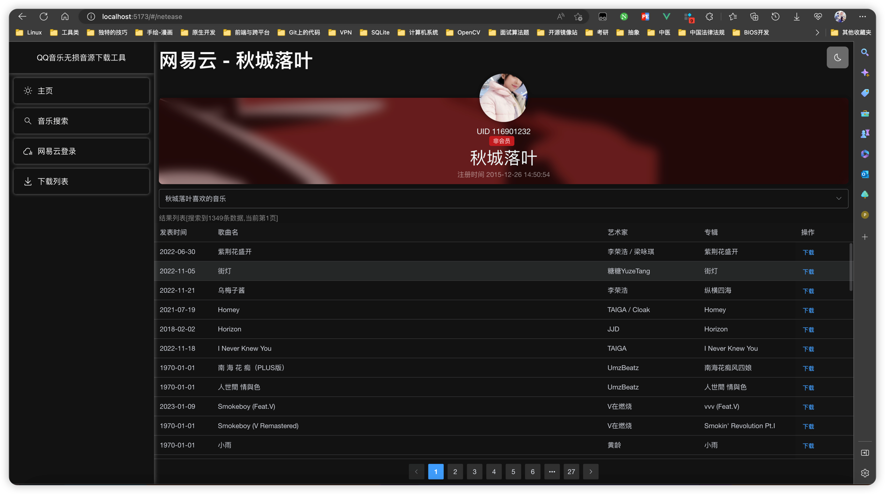

# 项目介绍

Create & Design By QiuChenly.

这是一个批量下载 QQ 音乐/酷我音乐/网易云会员无损音质歌曲的脚本,技术含量并不是很大,仅供参考。

参考是让你参考代码，不是让你想着法儿去白嫖。
今天你不愿意掏198的数字专辑费用，明天你就会失去赚到198万的机会。
眼界决定了你的未来，格局决定了你的上限。鲁迅曾经说过:舍小我成大我,我不入地狱谁入地狱?
所以白嫖的事情我来，付钱你来。

```
前端技术: 
Vue3+TS+Pinia+ElementUI Plus

后端技术: 
Python3.11.2 + Flask + Concurrency协程

开发环境:
MacBook Pro 16'' 2019 
i9-9880H 2.3Ghz + 16G DDR4
macOS Ventura 13.3
Python 3.11.2
PyCharm Professional
```

教程只能解决使用方法上的问题，解决不了dinner的问题。

# 已知问题

1. Windows的领先一个世纪的优美设计导致我操着落后一个世纪的技术无法完美适配它，这波是我的。
2. QQ音乐搜不到,是因为搜索频率过快。别问我为什么才搜两次就频繁了，你问qq。
3. 下载歌曲后前端页面没有提示，看命令行窗口就知道有没有下载成功了。
4. u tell me.

# 新特性

| 功能                 | 状态  | 附加说明                                                 |
|--------------------|-----|------------------------------------------------------|
| 网易云会员歌曲搜索&歌单下载     | 已完成 | 版权问题灰色歌曲没有CDN资源缓存 无法下载                               |
| 酷我音乐无损音质下载         | 待修复 | 支持Flac和320KbpsMP3下载 服务器已经禁止下载 暂时无法解析直链               |
| 咪咕无损下载             | 已完成 | 可以下载Flac/320KbpsMP3歌曲                                |
| QQ音乐无损会员/高解析度无损下载  | 待修复 | 第三方服务器好像已经挂了 估计这个服务器qq被封了 暂时用不了 搜索不到歌曲的话多搜索几次或者换酷我接口 |
| FreeMyMP3/高解析度无损下载 | 已完成 | 狠狠的加密                                                |

基于web的友好界面出来啦



---

# 使用方法

[//]: # (为确保账户安全，用户token本地按需保留。且线上服务使用扫码登录。)

[//]: # (![img_3.png]&#40;md/media/img_3.png&#41;)

[//]: # (### 如果你需要生成 requirements.txt 文件)

[//]: # ()

[//]: # (```bash)

[//]: # (pip install pipreqs # 安装)

[//]: # (pipreqs ./ --encoding=utf8 --force # 在文件夹中执行)

[//]: # (```)

### 0. 代码更新频繁,切记及时更新

有问题先下载最新的代码再看看是不是已经被解决了，而不是拿着几天前的代码问我为什么启动不了。
你怎么不问问你自己一年前追的女神怎么今天跟别人酒店里泡芙都流出来了，为什么你还没追到呢？

有一部分人可能没接触过代码编程，我是理解你的茫然的。

但是你小白不代表我就要迁就你。小白就应该不会百度？就应该不会自主解决问题？
我迁就你？你是小可爱?

楼主一般情况下脾气是很温和的，但是架不住小可爱太多了。提的也是可爱dinner问题，令人忍俊不禁莞尔一笑。

只有你学校的老师才会耐心解决你的问题，我只对我的学生负责，我不对小可爱负责。

### 1. 安装环境

首先安装最新的 python3.11.2 到你的操作系统里。

Windows用户强制安装此版本: [点击下载 -> Python3.11.2](https://www.python.org/ftp/python/3.11.2/python-3.11.2-amd64.exe)

```
Windows用户须知: 不是Windows用户不用看这一段小作文

首先我在此明确表示我的观点: Windows就是全宇宙最优秀的操作系统。

1.卸载电脑上所有的python版本,哪怕是3.10都不行.
如果你会玩python,那么你可以不用看这个提示.
如果你就是个纯纯的新手,我的建议是认真看一下.

2.Windows应用商店的残疾Python版本不要安装.
装完出问题然后还要明知故问,我会为你送上优美的赞歌.
计算机技术基础不应该由我给你补.

3.不要把项目放在文件夹路径有空格的目录下
比如你非要把下载好的代码文件放到
D:/Program Files(x86)/Test 123/AB CD/
这种存在空格的路径下面,运行报错再来问我那你确实注定要被我赞美称颂.

4.题外话
你要实在不会用,就真别用了吧.
但是你用不了就别到处发"这东西根本没吊用"之类的言论
你dinner不代表别人dinner。
球球了,折磨你自己可以,别折磨我.

我一个不用Windows人为啥要我兼容Windows?
就是为了兼容Windows可爱设计老子还得往代码里专门掺入优质代码是吧？
你有想法可以直接Pull Request&Merge代码
而不是TM在那一躺反馈说Windows上用不了xxx运行报错然后让我更新。

我又不用Windows，说白了Windows用户死活与我何干。
所以请Windows用户不要己所不欲勿施于人，共建和谐互联网大家庭。
最后，Windows我测你码。
```

macOS用户: 系统自带的python3.9版本就够了 不需要另外安装

以下所有操作皆默认假设CMD/Powershell/Bash/zsh的当前目录在：

```
(Windows) 
D:/Downloads/QQFlacMusicDownloader-master/
在文件夹空白处按住shift+鼠标右击,点击"在此处打开PowerShell"。
如果你很懂，cd命令进入上面的目录也行。

(macOS/Unix/Linux) 
~/Download/QQFlacMusicDownloader-master/
终端cd进入上面的目录.
```

安装依赖包如果出现 404 错误或者太慢，可以用下面的代码切换到清华大学服务器安装。

```bash
# 设置python的依赖安装镜像服务器为清华大学服务器
pip3 config set global.index-url https://pypi.tuna.tsinghua.edu.cn/simple
```

```bash
# 安装软件依赖必须包
pip3 install -r requirements.txt 
```

### 2. 进入软件包目录下启动软件

终端/控制台 进入到本文件所在的目录 执行以下指令:

```bash
python3 MainServer.py
```

由于Windows的可爱设计,在Windows上可能是

```commandline
python MainServer.py
```

如果你是windows10/11,那么系统很有可能会让你安装Windows应用商店的Python残疾版本.
别TM装残疾版本了。看看上面Windows用户须知行吗？

启动后应该能看到这些信息，即表示你启动成功。没看到类似下面的信息说明没成功。

没成功你也别急，截图+操作环境+操作步骤详细给出一份报告，而不是用几个字"本地环境实测无法启动"来概括。
恕我直言，你不是文曲星，没那本事几个字概括核心要点就不要概括，我理都不想理你。


成功后google chrome/Microsoft Edge/Safari之类的浏览器打开[http://127.0.0.1:8899](http://127.0.0.1:8899)即可打开新世界

# 声明

本代码 GPLV3 授权使用，禁止商业用途，仅供研究学习 python 技术使用，不得使用本代码进行任何形式的牟利/贩卖/传播，禁止在 qq
群传播，本项目仅供个人私下研究学习使用，请支持 QQ 正版音乐！

下载的音乐文件在试听后请在 24 小时内删除，谢谢！
仅限在中国大陆的宪法许可情况下使用，用户造成的一切法律责任与后果都由您自己独自承担，作者概不负责！

本项目仅限研究交流学习使用。

# 其他资料

[早期接口 QMD Apk的逆向过程](./md/README.md)

# 名词解释

1. dinner: 低能儿
2. 可爱: 傻b
3. 小可爱: 大傻b
4. 领先: 落后
5. 优美: 脑瘫
6. 我测你吗: 丁真家乡话懂的都懂
7. 优质代码: 垃圾代码