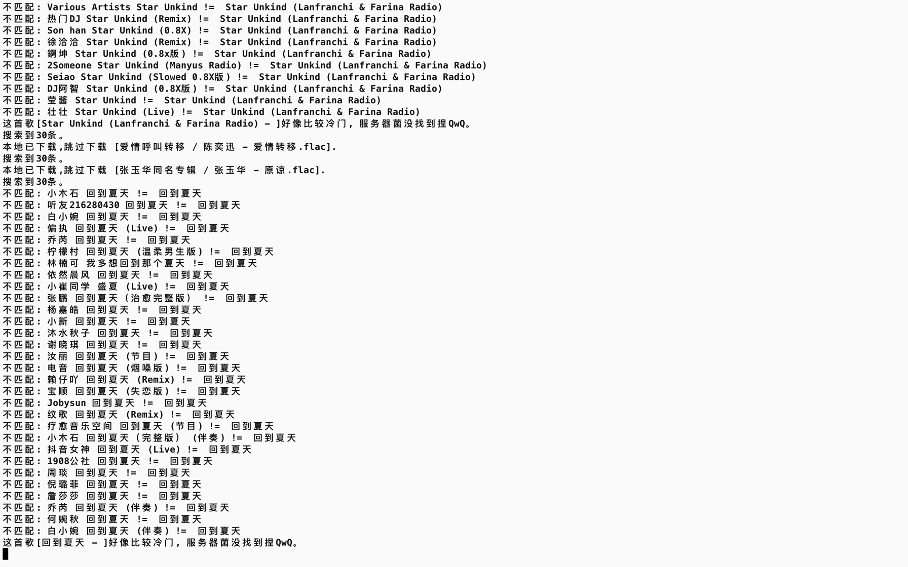
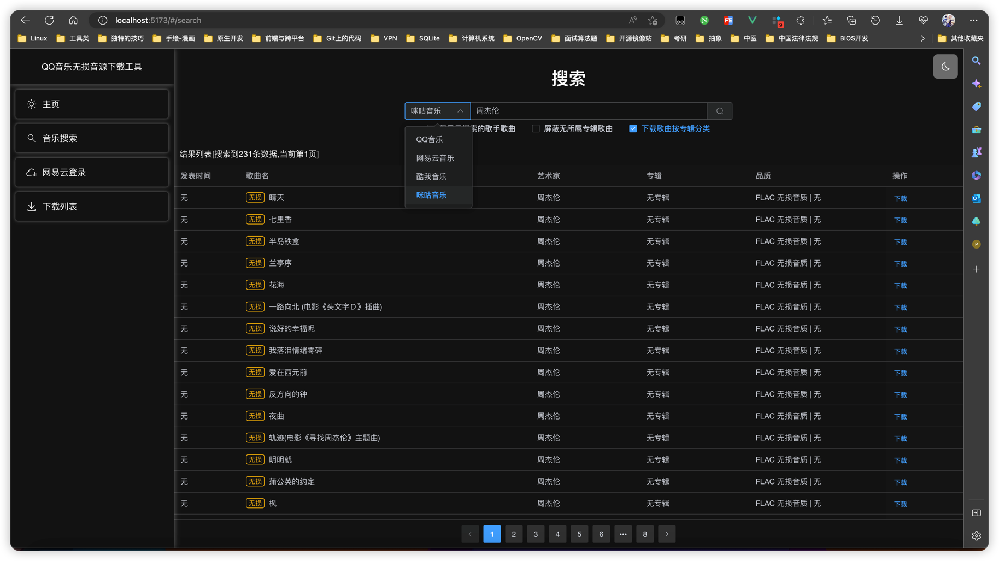
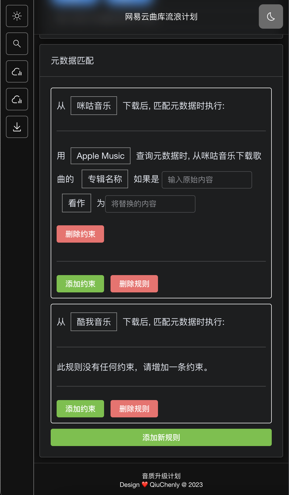
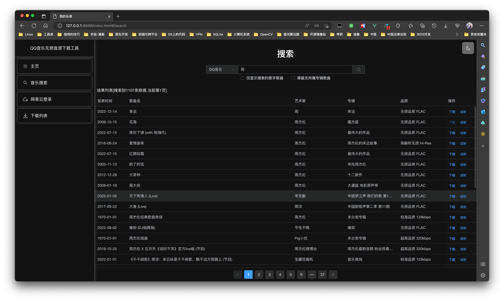
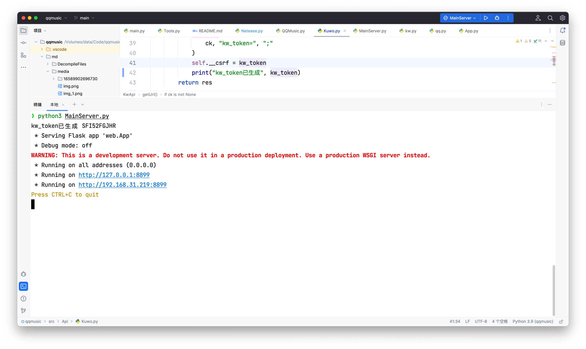
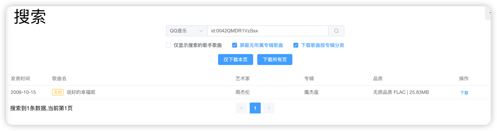
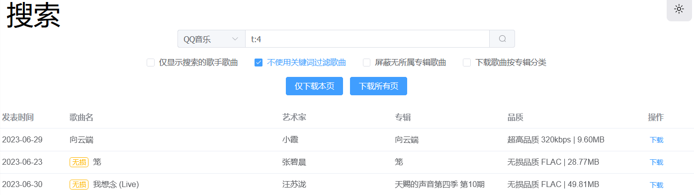
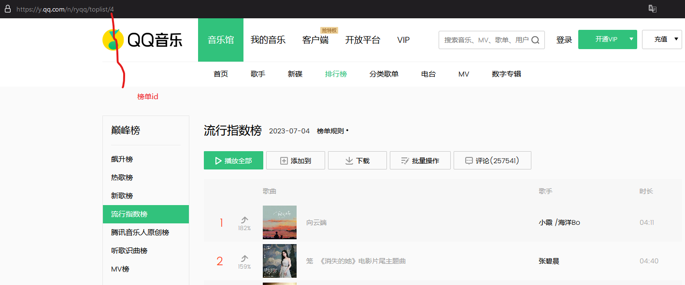
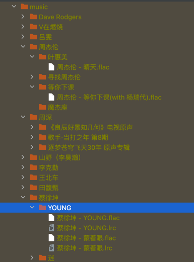
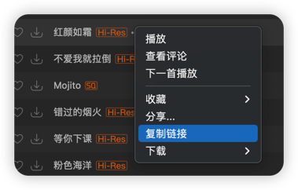

# 大纲

<!-- TOC -->

- [大纲](#大纲)
- [介绍](#介绍)
- [已知问题](#已知问题)
  - [关于网易云登录功能的声明:](#关于网易云登录功能的声明)
- [前后端源码文件夹](#前后端源码文件夹)
  - [特别功能](#特别功能)
    - [已支持元数据+内嵌歌词封面信息写入](#已支持元数据内嵌歌词封面信息写入)
    - [即将增加新功能](#即将增加新功能)
- [使用方法](#使用方法)
    - [0. 代码更新频繁,切记及时更新](#0-代码更新频繁切记及时更新)
    - [1. 安装环境](#1-安装环境)
    - [2. 进入软件包目录下启动软件](#2-进入软件包目录下启动软件)
    - [高级搜索方法](#高级搜索方法)
    - [新增歌曲元数据刮削内嵌](#新增歌曲元数据刮削内嵌)
    - [新增网易云盘歌曲信息纠错](#新增网易云盘歌曲信息纠错)
      - [确认匹配](#确认匹配)
      - [取消匹配](#取消匹配)
    - [Docker镜像部署](#docker镜像部署)
    - [自定义端口设置](#自定义端口设置)
- [免责声明](#免责声明)
- [致谢](#致谢)
- [其他资料](#其他资料)
- [名词解释](#名词解释)

<!-- TOC -->

# <p align="center">介绍</p>

<p align="center">Create & Design By QiuChenly</p>
<br/>
这是一个批量下载 QQ 音乐/酷我音乐/网易云会员无损音质歌曲的脚本,技术含量并不是很大,仅供参考。

参考是让你参考代码，不是让你想着法儿去白嫖。
今天你不愿意掏198的数字专辑费用，明天你就会失去赚到198万的机会。

眼界决定了人生未来，格局决定了人生上限。哥们主打的就是一个三观。

鲁迅曾经说过:舍小我成大我,我不入地狱谁入地狱?

所以白嫖的事情我来，付钱你来。

```any
前端技术:
Vue3+TS+Pinia+ElementUI Plus

后端技术:
Python3.11.2 + Flask + Concurrency协程

开发环境:
BenQ Laptop Core Duo 双核 1.2Ghz + 2GB DDR3

OS : Windows 7 x64
Env: Python 3.11.2
IDE: Windows Notepad
```

教程只能解决使用方法上的问题，解决不了dinner的问题。

# 已知问题

1. Windows用户可能体验不是很好，因为很多适配坑。
2. QQ音乐搜不到,是因为搜索频率过快。别问我为什么才搜两次就频繁了，你问qq。
3. 下载歌曲后前端页面没有提示，看命令行窗口就知道有没有下载成功了。

## 关于网易云登录功能的声明:

- 第三方网易云API服务器来自于互联网，开发者不承认且不担保其具有官方服务器性质，并对该服务器可能会泄露用户信息的可能性保持怀疑。
- 此服务器不可信，请使用完后修改网易云账号密码避免账号失窃。
- 本项目不会保存任何个人隐私信息，但是不对使用的第三方服务器安全性/隐私性做保证。
- 使用者因使用本服务导致的数据泄露账号失窃等问题由使用者独自承担后果，开发者概不负责。
- 使用本服务即表示你同意以上条款，对于使用者在明知或不知以上条款情况下使用本项目所造成的任何数据/泄露隐私泄漏的后果由使用者自行承担，开发者不对任何数据安全性作保证。
- 本项目为完全公益性项目，谢绝任何形式打赏与钱财赠与，以前不会接受以后也不会接受。
- 使用本项目所造成的一切数据泄露，账号失窃，财产损失等严重后果有用户自行承担风险，开发者已经对用户可能所受到的攻击和安全问题做到了尽可能的提示与告知。
- 如果本项目侵犯了你的合法权益，请电子邮件到qiuchenly@outlook.com,我将第一时间删库跑路。
- 总结: 号没了跟我无关

# 前后端源码文件夹

前端界面源代码:
[WebSourceCode](WebSourceCode)

后端Flask主代码:
[flaskSystem](flaskSystem)

提交代码时源码顶部的版权注释尽量不要修改，这是我IDE自动生成的，每次都会自动更新。
如果你需要保留你的修改记录，可以通过Google风格的注释附加在函数注释上:


## 特别功能

| 功能        | 状态 | 附加说明                                 |
|-----------|----|--------------------------------------|
| 酷我音乐      | ✅  | 支持Flac和320KbpsMP3下载 根据网友梨花喵的加密算法获取解析 |
| FreeMyMP3 | ⌛️ | 狠狠的加密 v2算法已破解 下载接口参数有问题 暂时不可用        |
| 咪咕音乐      | ✅  | 可以下载Flac/320KbpsMP3歌曲                |
| QQ音乐      | ✅  | 已经修复官方无损解析接口                         |
| 网易云音乐     | ❌  | 版权问题灰色歌曲没有CDN资源缓存 无法下载               |

基于web的友好界面出来啦




### 已支持元数据+内嵌歌词封面信息写入




目前仅适配:
目前已完整支持全部常见元数据补全
MP3/FLAC/HiRes格式文件补全

1. 咪咕音乐
2. 酷我音乐
3. QQ音乐 (最全面支持 只要能写入的元数据信息我都写入了包括专辑/歌手/专辑高清图像/专辑简介/流派/歌曲语言...)

### 即将增加新功能

功能现在还没法用，不要乱点。你点了是没有反应的。

1. 本地音乐元数据匹配
2. 下载音乐时自动匹配元数据过滤系统
   

---

# 使用方法

### 0. 代码更新频繁,切记及时更新

有问题先下载最新的代码再看看是不是已经被解决了，而不是拿着几天前的代码问我为什么启动不了。
你怎么不问问你自己一年前追的女神怎么今天跟别人酒店里泡芙都流出来了，为什么你还没追到呢？

楼主一般情况下脾气是很温和的，但是架不住小可爱太多了。提的也是可爱dinner问题，令人忍俊不禁莞尔一笑。

只有你学校的老师才会耐心解决你的问题，我只对我的学生负责，我不对小可爱负责。

### 1. 安装环境

首先安装最新的 python3.11.2 到你的操作系统里。

Windows用户强制安装此版本: [点击下载 -> Python3.11.2](https://www.python.org/ftp/python/3.11.2/python-3.11.2-amd64.exe)

```any
Windows用户须知: 不是Windows用户不用看这一段小作文

首先我在此明确表示我的观点: Windows就是全宇宙最优秀的操作系统。

1.卸载电脑上所有的python版本,哪怕是3.10都不行.
如果你会玩python,那么你可以不用看这个提示.
如果你就是个纯纯的新手,我的建议是认真看一下.

2.Windows应用商店的残疾Python版本不要安装.
装完出问题然后还要明知故问,我会为你送上优美的赞歌.
计算机技术基础不应该由我给你补.

3.不要把项目放在文件夹路径有空格的目录下
比如你非要把下载好的代码文件放到
D:/Program Files(x86)/Test 123/AB CD/
这种存在空格的路径下面,运行报错再来问我那你确实注定要被我赞美称颂.

4.题外话
你要实在不会用,就真别用了吧.
但是你用不了就别到处发"这东西根本没吊用"之类的言论
你dinner不代表别人dinner。
球球了,折磨你自己可以,别折磨我.

windows用户如果有任何体验上的问题，请提交代码Merge。不要一句“不行没法用”来反馈。哥们看到这种可爱issues直接给你关了。
让我们共建和谐互联网大家庭。
最后，Microsoft Windows我测你的码。
```

macOS用户: 系统自带的python3.9版本就够了 不需要另外安装

以下所有操作**皆默认假设CMD/Powershell/Bash/zsh的当前目录**在：

```
(Windows)
D:/Downloads/QQFlacMusicDownloader-master/
在文件夹空白处按住shift+鼠标右击,点击"在此处打开PowerShell"。
如果你很懂，cd命令进入上面的目录也行。

(macOS/Unix/Linux)
~/Download/QQFlacMusicDownloader-master/
终端cd进入上面的目录.
```

安装依赖包如果出现 404 错误或者太慢，可以用下面的代码切换到清华大学服务器安装。

```bash
# 设置python的依赖安装镜像服务器为清华大学服务器
pip3 config set global.index-url https://pypi.tuna.tsinghua.edu.cn/simple
```

```bash
# 安装软件依赖必须包
pip3 install -r requirements.txt
```

### 2. 进入软件包目录下启动软件

终端/控制台 进入到本文件所在的目录 执行以下指令:

```bash
python3 MainServer.py
```

由于Windows的可爱设计,在Windows上可能是

```commandline
python MainServer.py
```

如果你是windows10/11,那么系统很有可能会让你安装Windows应用商店的Python残疾版本，如果你不知道该不该安装的话，看看上面Windows用户须知。

启动后应该能看到这些信息，红色警告不是错误，无知可以但不要怀疑哥们的实力。看到类似于下面的输出提示即表示你启动成功。没看到类似下面的信息说明没成功。

没成功你也别急，截图+操作环境+操作步骤详细给出一份报告，而不是用几个字"本地环境实测无法启动"来概括。
恕我直言，你不是文曲星，没那本事几个字概括核心要点就不要概括，我理都不想理你。


成功后google chrome/Microsoft Edge/Safari浏览器打开[http://127.0.0.1:8899](http://127.0.0.1:8899)即可打开新世界。

只在Edge浏览器测试UI通过，建议全部使用Microsoft Edge浏览器访问。

### 高级搜索方法

目前 **仅支持** QQ音乐/咪咕音乐搜索。

| 指令                 | 例子                           | id从哪找                        | 作用                                                                              |
|--------------------|------------------------------|------------------------------|---------------------------------------------------------------------------------|
| (album) b:+专辑ID    |    |    | (QQ音乐)获取一张专辑里的歌曲                                                                |
| (album) b:+专辑ID    |           |       | (咪咕)获取一张专辑里的歌曲                                                                  |
| (playlist) p:+歌单ID |    |    | 获取一张歌单里的所有歌曲,需要注意的是列表下面的分页是无效的 不要切换页面 因为他一次性是加载的整个歌单列表                          |
| (id) id:+歌曲ID      |  |  | 有时候有些二逼非主流歌曲名称是及其之难以用输入法扣出来的，这个时候可以用id直接获取到这首歌。不想用那些二逼非主流歌曲做演示，用我最爱的杰伦演示给你们看看得了 |
| (toplist) t:+榜单ID  |  |  | 获取一张榜单里的歌曲                                                                      |

2023.4.14

- 修复歌曲关键词过滤不可定制化搜索的问题，满足搜索部分土嗨神曲的需求。现在可以在搜索界面关闭关键词过滤或者在首页自定义过滤关键词。

### 新增歌曲元数据刮削内嵌

开发中，目前效果不等于最终效果。

本功能用于为本地音乐文件写入元数据功能，实现内嵌歌词文件/歌手/专辑/封面图片/专辑序号/发布年代等元数据信息，避免播放时一片空白无法加载歌曲信息的问题出现。
主要使用以下接口:

1. iTunes 专辑信息接口 + 歌词信息 + 苹果特有的4K超清专辑封面图
2. QQ 音乐专辑信息接口 + 歌词信息 + 800x800低清专辑封面图

梗小鬼提问时间<br>
Q: 为什么不用酷我/咪咕接口？<br>
A: 因为老子高兴。iTunes+QQ基本上全球音乐元数据都全了，怎么，不够你用是吧？

为了保证数据精确度，仅支持完整匹配以下文件夹结构:<br>
/周杰伦/专辑列表文件夹/周杰伦 - 一路向北.flac

例子：


或已经内置歌手专辑与歌曲名称的flac文件，对于这类文件将从iTunes/QQ中搜索补全剩余专辑信息。（从本项目下载的歌曲均自动已存在此信息）

效果预览：

灰色无任何信息的歌曲就是没有自动匹配元数据的，写入了元数据的歌曲将会拥有精美封面图和完整的歌曲专辑元数据信息---这一切都本地存储在音乐文件中！

### 新增网易云盘歌曲信息纠错

可以搜索歌曲或指定歌曲ID来关联你上传到网易云盘里的歌曲。
在使用前需要打开网易云登录界面一次更新Cookie才可以访问到你的云盘数据。
加载时由于一次加载1000条数据，所以加载缓慢，请等几秒钟。

#### 确认匹配

通过你设置的ID或者搜索到的歌曲来绑定这首歌的实际歌曲数据。
如果你想取消某首歌的匹配可以点击取消匹配。

#### 取消匹配

取消网易云自动/手动匹配的错误歌曲信息。有时候我们上传的歌曲信息网易云会识别错误，所以我们可以取消匹配或者手动更新。


歌曲ID如何获得？




### Docker镜像部署

可以通过自己自己打包 Docker 进行部署，也可以使用本项目打包好的容器进行部署

自己打包 Docker 进行部署执行以下命令：

```bash
docker build -t dockerimage .
```

使用本项目打包好的容器进行部署：

```bash
docker pull registry.cn-hangzhou.aliyuncs.com/music_downloader/qq_flac_music_downloader
```

Docker 镜像部署需要进行端口映射，可以采用以下命令进行端口映射：

（注意：用你的本地使用目录替换下方“本地目录” 如 E:\music）

```bash
docker run -p 127.0.0.1:8899:8899 -v 本地目录:/workspace/music -it dockerimage:latest
```

更新方式：先运行 ```docker ps -a ```查看容器名称

然后

```
docker stop 容器名称
docker rm 容器名称
```

最后，上面```docker pull```和```docker run```的代码重新执行一遍

docker-compose部署方式

本地新建txt，重命名为docker-compose.yml （不会修改后缀请百度）

复制以下内容，同样注意替换“本地目录”

或者你直接下载项目中的docker-compose.yml，然后自行修改本地目录

```
version: "3"
services:
  downloader:
    image: registry.cn-hangzhou.aliyuncs.com/music_downloader/qq_flac_music_downloader
    container_name: music
    network_mode: bridge
    volumes:
      - 本地目录:/workspace/music
    ports:
      - "127.0.0.1:8899:8899"
    restart: always
```

然后 打开cmd命令行,cd到docker-compose.yml所在目录  ```docker-compose up -d```

需要更新的时候，也是cd到docker-compose.yml所在目录

```
docker-compose pull
docker-compose up -d
```

相对docker，更新比较简单，所以个人比较推荐使用docker-compose的方式

### 自定义端口设置

部分设备会存在 8889 端口被占用的情况，部署时可自定义端口，终端/控制台 进入到本文件所在的目录 执行以下指令:

```bash
# []内为可选参数
python3 MainServer.py [--port 8999]
```

docker 部署可自行切换映射本地端口，以解决端口被占用情况。

# 免责声明

禁止任何形式的商业用途，包括但不仅限于售卖/打赏/获利，不得使用本代码进行任何形式的牟利/贩卖/传播，再次强调仅供个人私下研究学习技术使用，有条件者请支持正版音乐！
律师函请发给提供这些音乐资源解析服务的网站运营方，本项目仅以纯粹的技术目的去学习研究，如有侵犯到任何人的合法权利，请致信qiuchenly@outlook.com，我将在第一时间删库跑路

本项目基于 GPL V3.0 许可证发行，以下协议是对于 GPL V3.0 的补充，如有冲突，以以下协议为准。

词语约定：本协议中的“本项目”指QQFlacMusicDownloader项目；“使用者”指签署本协议的使用者；“官方音乐平台”指对本项目内置的包括酷我、网易云、QQ音乐、咪咕等音乐源的官方平台统称；“版权数据”指包括但不限于图像、音频、名字等在内的他人拥有所属版权的数据。

本项目的数据来源原理是从各官方音乐平台的公开服务器中拉取数据，经过对数据简单地筛选与合并后进行展示，因此本项目不对数据的准确性负责。
使用本项目的过程中可能会产生版权数据，对于这些版权数据，本项目不拥有它们的所有权，为了避免造成侵权，使用者务必在24小时内清除使用本项目的过程中所产生的版权数据。
本项目内的官方音乐平台别名为本项目内对官方音乐平台的一个称呼，不包含恶意，如果官方音乐平台觉得不妥，可联系本项目更改或移除。
本项目内使用的部分包括但不限于字体、图片等资源来源于互联网，如果出现侵权可联系本项目移除。
由于使用本项目产生的包括由于本协议或由于使用或无法使用本项目而引起的任何性质的任何直接、间接、特殊、偶然或结果性损害（包括但不限于因商誉损失、停工、计算机故障或故障引起的损害赔偿，或任何及所有其他商业损害或损失）由使用者负责。
本项目完全免费，仅供个人私下小范围研究交流学习 python
技术使用, 且开源发布于 GitHub
面向全世界人用作对技术的学习交流，本项目不对项目内的技术可能存在违反当地法律法规的行为作保证，禁止在违反当地法律法规的情况下使用本项目，对于使用者在明知或不知当地法律法规不允许的情况下使用本项目所造成的任何违法违规行为由使用者承担，本项目不承担由此造成的任何直接、间接、特殊、偶然或结果性责任。
若你使用了本项目，将代表你接受以上协议。

音乐平台不易，请尊重版权，支持正版。

# 致谢

感谢所有项目的参与/贡献者，也感谢提出issues的各位用户。

# 其他资料

[早期接口 QMD Apk的逆向过程](./md/README.md)

# 名词解释

1. dinner: 低能
2. 我测你m: 一眼顶真 鉴定为纯纯的范剑
